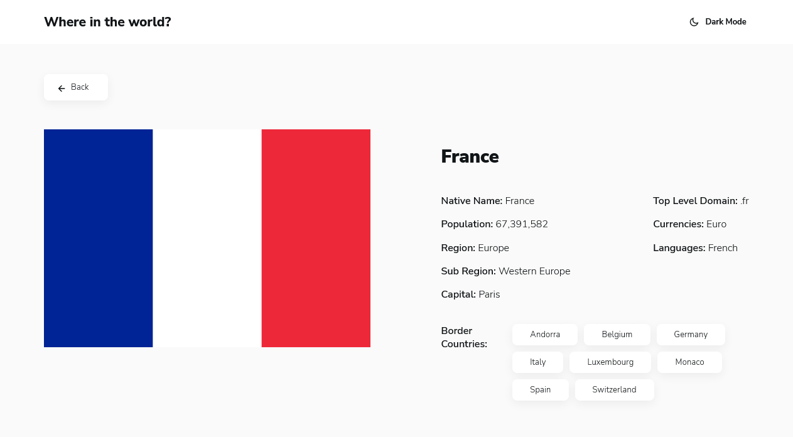

# Frontend Mentor - REST Countries API with color theme switcher solution

This is my solution to the [REST Countries API with color theme switcher challenge](https://www.frontendmentor.io/challenges/rest-countries-api-with-color-theme-switcher-5cacc469fec04111f7b848ca).

## Table of contents

- [Overview](#overview)
  - [The challenge](#the-challenge)
  - [Screenshot](#screenshot)
  - [Links](#links)
- [My process](#my-process)
  - [Built with](#built-with)
  - [What I learned](#what-i-learned)
  - [Useful resources](#useful-resources)

## Overview

### The challenge

Users should be able to:

- See all countries from the API on the homepage
- Search for a country using an `input` field
- Filter countries by region
- Click on a country to see more detailed information on a separate page
- Click through to the border countries on the detail page
- Toggle the color scheme between light and dark mode *(optional)*

### Screenshots

### Links

- [Live Site URL](https://rest-countries-api-lac.vercel.app/)

## My process

### Built with

- [TypeScript](https://www.typescriptlang.org/) - JS with syntax for types
- [React](https://reactjs.org/) - JS library
- [Next.js](https://nextjs.org/) - React framework
- [SASS](https://sass-lang.com/) - For styles

### What I learned

With this challenge, it was the first time that I had to set up a theme switcher. So I learned how to develop one using React Contexts and SCSS mixins.

It was also my first time using React Contexts, so I learned how to use them, here for the theme switcher and the country filters.

And finally I also practiced more styling with SCSS, which I had used very little in my projects so far.

### Useful resources

- [How to Create a Dark Mode in Sass](https://medium.com/@katiemctigue/how-to-create-a-dark-mode-in-sass-609f131a3995) - This helped me for understanding the different ways to create a theme switcher.
- [Thème clair et sombre en SCSS et React](https://www.zaratan.fr/next-refactor-theme-scss) - I was literally stucked because my themed mixins weren't working in my components stylesheets, so after some days of research, I found that article which explained everything I needed to know to solve that problem. That was very interesting, even if I was understanding the issue before reading it, I wasn't finding a solution for it, and this is where Denis Pasin's solution helped me a lot.
